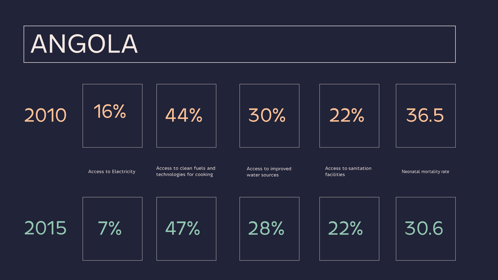

# Access to electricity and basic health needs and how they affect the neonatal mortality rate in rural Africa

### Description

According to UNICEF, progress in reducing neonatal mortality in the world has been slower than for other children. Thus, 
the first 28 days of life are the most vulnerable time for a child's survival. 
The following visualization explores how energy and access to basic needs have affected this phenomenon in the context of rural Africa.
In order to do so, the following variables where taken into consideration:

1. Access to electricity 
2. Access to clean fuels and technologies for cooking
3. Access to improved water sources
4. Access to sanitation facilities

The main component of the visualization consists of a dashboard that gets updated with the corresponding information
of the points mentioned above. The user has the opportunity to compare the data from 2010 and 2015 in order to evaluate
the performance of a specific country.

### Sketch

### Sources

1. [World Bank](http://www.worldbank.org/en/topic/energy/publication/Global-Tracking-Framework-Report)
2. [Our World in Data - Oxford University](https://ourworldindata.org/about)
3. [UNICEF](https://data.unicef.org/children-sustainable-development-goals/)

### Acknowledgements

The following project was made possible thanks to the ongoing partnership between the [UNDP Regional
Bureau for Africa](http://www.africa.undp.org/content/rba/en/home.html) and the MS Data Visualization Program at 
[Parsons School of Design](https://www.newschool.edu/parsons/ms-data-visualization/). 

